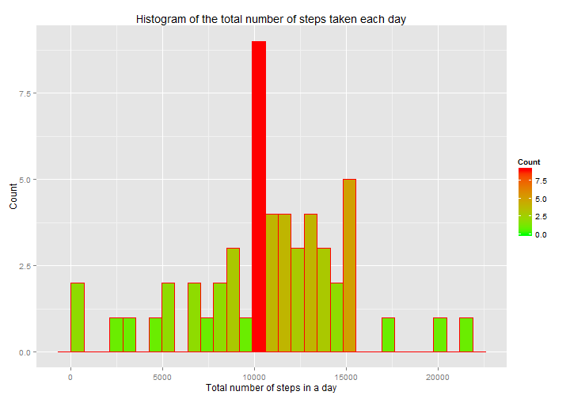
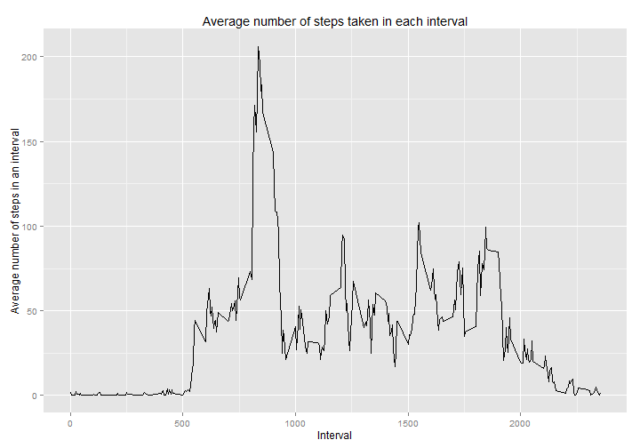
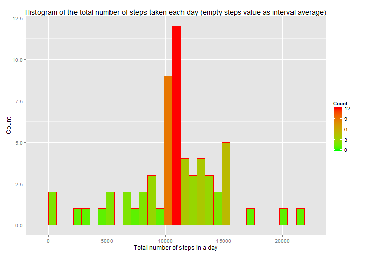
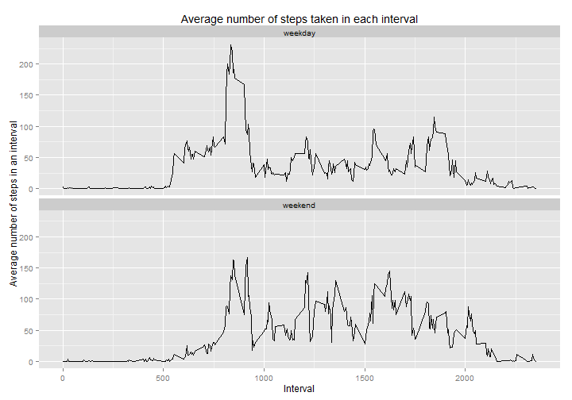

# Reproducible Research: Peer Assessment 1

This is an assignment for the Coursera Reproducible Research course.
  
Libraries to load:  
- **data.table** - a package used to extend the data.frame class and perform 
fast operations on it  
- **dplyr** - a package used to add some extra grammar of data manipulation  
- **ggplot2** - a package used to extend an implementation of the Grammar 
of Graphics  
- **lubridate** - a package which makes dealing with dates a little easier  


```r
library(data.table)
library(dplyr)
library(ggplot2)
library(lubridate)
```

## Loading and preprocessing the data

Downloading, unpacking, reading and data transformation.


```r
activity.data.filename     <- "activity.csv"
activity.data.zip.filename <- "activity.zip"
file.url <-
    "http://d396qusza40orc.cloudfront.net/repdata%2Fdata%2Factivity.zip"

if (!file.exists(activity.data.filename)) {
    download.file(file.url, destfile = activity.data.zip.filename, mode="wb")
    unzip(activity.data.zip.filename)
    file.remove(activity.data.zip.filename)
}

activity.DT <- fread(activity.data.filename, sep = ",", header = TRUE,
                     data.table = TRUE, na.strings = c("NA"),
                     colClasses = c("integer", "character", "integer"),
                     verbose = FALSE)

activity.DT <- activity.DT[, date := as.Date(date, format = "%Y-%m-%d")]
```

## What is mean total number of steps taken per day?

Calculation the total number of steps taken per day and making a histogram of 
the total number of steps taken each day.


```r
setkey(activity.DT, date)

activity.grouped.by.date.DT <- activity.DT %>%
    select(date, steps) %>%
    filter(!is.na(steps)) %>%
    group_by(date) %>%
    summarize(steps.sum = sum(steps)) %>%
    arrange(date)

hist.plot <- ggplot(data = activity.grouped.by.date.DT,
                    aes(activity.grouped.by.date.DT$steps.sum)) +
    geom_histogram(col = "red",
                   aes(fill=..count..)) +
    scale_fill_gradient("Count", low = "green", high = "red") +
    labs(title = "Histogram of the total number of steps taken each day") +
    labs(x = "Total number of steps in a day", y = "Count")

mean.total.day.steps   <-
    round(mean(activity.grouped.by.date.DT$steps.sum, na.rm = TRUE), digits = 2)

median.total.day.steps <-
    median(activity.grouped.by.date.DT$steps.sum, na.rm = TRUE)

print(hist.plot)
```

 

The mean of the total number of steps taken per day is 
**10766.19**.  
The median of the total number of steps taken per day is 
**10765**.


## What is the average daily activity pattern?

Making a time series plot of the 5-minute interval (x-axis) and the average 
number of steps taken, averaged across all days (y-axis).


```r
rm(activity.grouped.by.date.DT)

setkey(activity.DT, interval)

activity.grouped.by.interval.DT <- activity.DT %>%
    select(interval, steps) %>%
    filter(!is.na(steps)) %>%
    group_by(interval) %>%
    summarize(steps.avg = mean(steps)) %>%
    arrange(interval)

avg.interval.plot <- ggplot(data = activity.grouped.by.interval.DT,
                            aes(x = interval, y = steps.avg)) +
    geom_line() +
    labs(title = "Average number of steps taken in each interval") +
    labs(x = "Interval",
         y = "Average number of steps in an interval")

max.avg.interval.rec <-
    activity.grouped.by.interval.DT[
        steps.avg == max(activity.grouped.by.interval.DT$steps.avg), ]

print(avg.interval.plot)
```

 

The 5-minute interval 
**835**, 
on average across all the days in the dataset, contains the maximum number of 
steps. Its value is 
**206.17**.


## Imputing missing values

Analysis and support for missing values.

The strategy for missing values of variable **steps**:  
**The missing values are filled with the average value for each interval. The 
values are next rounded to the nearest integer values**.


```r
na.val.number <- sum(is.na(activity.DT$steps))
```

The total number of missing values in the dataset is **2304**.


Creating a new dataset that is equal to the original dataset but with the missing data filled in.

```r
activity.nafilled.DT <- inner_join(activity.grouped.by.interval.DT, activity.DT,
                                   by = c("interval" = "interval"))

rm(activity.grouped.by.interval.DT)

activity.nafilled.DT <-
    activity.nafilled.DT[is.na(steps), steps := as.integer(round(steps.avg))]
activity.nafilled.DT <- activity.nafilled.DT[, steps.avg := NULL]
```

Making a histogram of the total number of steps taken each day.

```r
setkey(activity.nafilled.DT, date)

activity.grouped.by.date.DT <- activity.nafilled.DT %>%
    select(date, steps) %>%
    group_by(date) %>%
    summarize(steps.sum = sum(steps)) %>%
    arrange(date)

hist.plot <- ggplot(data = activity.grouped.by.date.DT,
                    aes(activity.grouped.by.date.DT$steps.sum)) +
    geom_histogram(col = "red",
                   aes(fill=..count..)) +
    scale_fill_gradient("Count", low = "green", high = "red") +
    labs(title = paste("Histogram of the total number of steps taken each day",
                       "(empty steps value as interval average)")) +
    labs(x = "Total number of steps in a day", y = "Count")

mean.total.day.nafilled.steps   <-
    round(mean(activity.grouped.by.date.DT$steps.sum, na.rm = TRUE), digits = 2)

median.total.day.nafilled.steps <-
    median(activity.grouped.by.date.DT$steps.sum, na.rm = TRUE)

mean.total.day.steps.diff <-
    mean.total.day.steps - mean.total.day.nafilled.steps

median.total.day.steps.diff <-
    median.total.day.steps - median.total.day.nafilled.steps

total.day.steps.diff <- sum(activity.DT$steps, na.rm = TRUE) -
    sum(activity.nafilled.DT$steps)

print(hist.plot)
```

 

The mean of the total number of steps taken per day after filling NA values is  
**10765.64**.  
The median of the total number of steps taken per day after filling NA values is 
**10762**.

The difference in the mean of the total number of steps taken per day before and
after filling NA values is
**0.55**.

The difference in the median of the total number of steps taken per day before 
and after filling NA values is
**3**.

The difference of the total daily number of steps taken per day before and
after filling NA values is **-86096**.


## Are there differences in activity patterns between weekdays and weekends?

Creating a new factor variable in the dataset with two levels – “weekday” and 
“weekend” and making a panel plot containing a time series plot of the 5-minute 
interval (x-axis) and the average number of steps taken, averaged across all 
weekday days or weekend days (y-axis).

```r
activity.nafilled.week.DT <- activity.nafilled.DT %>%
    mutate(day.type =
           as.factor(ifelse(wday(date) %in% c(1, 7), "weekend", "weekday")))

rm(activity.nafilled.DT)

setkey(activity.nafilled.week.DT, interval)

activity.grouped.by.interval.day.type.week.DT <- activity.nafilled.week.DT %>%
    select(interval, steps, day.type) %>%
    filter(!is.na(steps)) %>%
    group_by(interval, day.type) %>%
    summarize(steps.avg = mean(steps)) %>%
    arrange(interval)

avg.interval.day.type.plot <- 
    ggplot(data = activity.grouped.by.interval.day.type.week.DT,
           aes(x = interval, y = steps.avg)) +
    geom_line() +
    facet_wrap(~ day.type, nrow = 2) +
    labs(title = "Average number of steps taken in each interval") +
    labs(x = "Interval",
         y = "Average number of steps in an interval")

print(avg.interval.day.type.plot)
```

 


